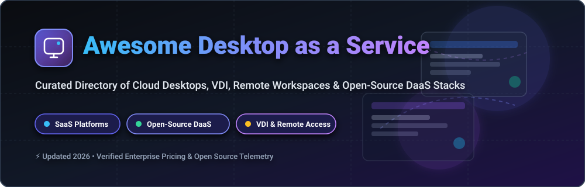

<p align="center">
  
</p>

<p align="center">
  <a href="https://github.com/ishandutta2007/Awesome-Awesome-Awesome"></a><a href="https://discord.gg/jc4xtF58Ve"></a>
  <a href="https://github.com/ishandutta2007/Awesome-Desktop-As-A-Service/stargazers"></a>
  <a href="https://github.com/ishandutta2007/Awesome-Desktop-As-A-Service/network/members"></a>
  <a href="https://github.com/ishandutta2007/Awesome-Desktop-As-A-Service/blob/main/LICENSE"></a>
  <a href="https://github.com/ishandutta2007"></a>
</p>

# 🖥️ Awesome Desktop as a Service (DaaS)

> **A curated collection of Desktop as a Service (DaaS) platforms, Virtual Desktop Infrastructure (VDI) engines, remote application gateways, browser-based Linux/Windows streaming, and open-source remote access tools.**

---

## 📑 Table of Contents

- [📊 Sector Overview \& Market Dynamics](#-sector-overview--market-dynamics)
- [🏢 Enterprise SaaS Platforms](#-enterprise-saas-platforms)
- [⚡ Open-Source GitHub Projects](#-open-source-github-projects)
- [🏗️ Architectural Blueprints for Self-Hosted DaaS](#️-architectural-blueprints-for-self-hosted-daas)
- [🤝 How to Contribute](#-how-to-contribute)
- [💖 Support \& Community](#-support--community)
- [📈 Star History](#-star-history)
- [📜 Disclaimer](#-disclaimer)

---

## 📊 Sector Overview & Market Dynamics

> 💡 **Market Insights**: The global **Desktop as a Service (DaaS)** market size is valued at **$6.8 Billion in 2026** and is projected to expand to **$16.2 Billion by 2030** at a Compound Annual Growth Rate (CAGR) of **~19.5%**. The industry is **moderately concentrated**, dominated by cloud hyperscalers (*Microsoft Azure, AWS*) and legacy enterprise VDI behemoths (*Citrix, Broadcom/Omnissa*), alongside specialized cloud management automation (*Nerdio*) and containerized browser isolation platforms (*Kasm*).

---

## 🏢 Enterprise SaaS Platforms

Below is a curated matrix of leading commercial DaaS and managed virtual desktop solutions, **sorted by parent company scale and market valuation (descending)**.

| 🏢 Product / Platform | 📝 Description | 💼 Company Scale / Valuation | 💳 Starting Pricing | 🎁 Free Tier / Trial Limits |
| :--- | :--- | :--- | :--- | :--- |
| **[Azure Virtual Desktop & Windows 365](https://azure.microsoft.com/products/virtual-desktop)** | Microsoft’s flagship cloud VDI and fixed-rate Cloud PC platform integrated with Microsoft 365 and Entra ID. | **~$3.3 Trillion** *(Microsoft Market Cap)* | **$28.00/user/mo** *(Windows 365)* or consumption pay-as-you-go (~$0.096/hr VM) | **30-Day Trial** for Windows 365 Business (1 license) + **$200 credit** on Azure Free Account |
| **[Amazon WorkSpaces](https://aws.amazon.com/workspaces/)** | Fully managed, secure cloud desktop service supporting Windows, Ubuntu Linux, and Amazon Linux. | **~$2.1 Trillion** *(Amazon Market Cap)* | **$7.25/mo base + $0.22/hr** *(AutoStop)* or **$25.00/user/mo** *(AlwaysOn)* | **3-Month Free Tier** (2 Standard WorkSpaces up to 40 combined hrs/mo) |
| **[VMware Horizon Cloud / Omnissa](https://www.omnissa.com/)** | Enterprise cloud and hybrid virtual desktop & app platform for global workforce delivery. | **~$800 Billion** *(Parent Market Cap / Leader)* | **$8.25/user/mo** *(Core SaaS control plane; excludes cloud compute)* | **60-Day Trial** evaluation license for registered enterprise accounts |
| **[Citrix DaaS](https://www.citrix.com/)** | High-performance enterprise DaaS with HDX protocol optimization and hybrid cloud orchestration. | **~$17 Billion** *(Cloud Software Group Valuation)* | **$10.00/user/mo** *(Citrix DaaS Standard for Azure; minimum user tier)* | **7-Day Guided Sandbox Trial** with pre-configured cloud desktop environments |
| **[Nerdio](https://nerdio.net/)** | Operations, deployment, and cost automation platform for Azure Virtual Desktop & Windows 365. | **$100M+ ARR** *(VC-Backed Enterprise Automation)* | **$3.00/active user/mo** *(Nerdio Manager for Enterprise)* | **30-Day Free Trial** for up to 250 active users with full feature access |
| **[Workspot](https://www.workspot.com/)** | Enterprise multi-cloud DaaS delivering low-latency Windows workstations across Azure, AWS, and GCP. | **VC-Backed** *(~$50M+ Total Funding)* | **$15.00/user/mo** *(BYO-Cloud)* or **$35.00/user/mo** *(All-inclusive)* | **30-Day Proof-of-Concept** hands-on test drive for up to 10 users |
| **[Apporto](https://www.apporto.com/)** | Next-gen browser-based virtual desktop & app streaming platform popular in education and corporate training. | **Growth Stage** *(Higher-Ed DaaS Leader)* | **$12.00/named user/mo** *(Institutional Virtual Lab tier)* | **14-Day Pilot Demo** for institutional evaluations (up to 5 concurrent sessions) |
| **[Kasm Workspaces (Commercial Cloud)](https://kasmweb.com/)** | Containerized web-streaming platform for browser isolation, secure workspaces, and OSINT desktops. | **~$10M+ ARR** *(Commercial & Open Source)* | **$10.00/user/mo** *(Cloud Browser / Starter)* or **$20.00/user/mo** *(Cloud Desktop)* | **Free Community Edition (CE)** self-hosted forever (up to 5 concurrent sessions) |
| **[V2 Cloud](https://v2cloud.com/)** | Simplified cloud desktop provider focused on SMBs, remote workers, and software vendors. | **SMB DaaS Provider** *(Privately Held)* | **$35.00/user/mo** *(Basic Windows Cloud Desktop: 1 vCPU, 2GB RAM)* | **7-Day Risk-Free Trial** with full virtual desktop features |
| **[Shells.com](https://www.shells.com/)** | Consumer and prosumer cloud virtual desktop for accessing Linux or Windows from any web device. | **Consumer DaaS Provider** *(Privately Held)* | **$14.95/mo** *(Basic Cloud PC: 1 vCPU, 40GB Storage, 2GB RAM)* | **7-Day Money-Back Guarantee** on all subscription plans |

---

## ⚡ Open-Source GitHub Projects

Below is a curated selection of open-source building blocks, streaming engines, VNC/RDP servers, and clientless remote desktop gateways, **sorted by GitHub Stars_Count (descending)**.

| 📦 Repository / Project | 📝 Description | ⭐ Stars_Count |
| :--- | :--- | :--- |
| **[RustDesk](https://github.com/rustdesk/rustdesk)** | Open-source, self-hostable remote desktop software written in Rust as a direct TeamViewer alternative. | <a href="https://github.com/rustdesk/rustdesk/stargazers"></a> |
| **[Sunshine](https://github.com/LizardByte/Sunshine)** | Low-latency, self-hosted game and desktop streaming server designed for Moonlight clients. | <a href="https://github.com/LizardByte/Sunshine/stargazers"></a> |
| **[Moonlight](https://github.com/moonlight-stream/moonlight-qt)** | Open-source NVIDIA GameStream and Sunshine client for streaming desktop environments across devices. | <a href="https://github.com/moonlight-stream/moonlight-qt/stargazers"></a> |
| **[noVNC](https://github.com/novnc/noVNC)** | HTML5 VNC client library and web application for browser-based remote desktop rendering without plugins. | <a href="https://github.com/novnc/noVNC/stargazers"></a> |
| **[FreeRDP](https://github.com/FreeRDP/FreeRDP)** | Core open-source implementation of the Remote Desktop Protocol (RDP) used across enterprise Linux systems. | <a href="https://github.com/FreeRDP/FreeRDP/stargazers"></a> |
| **[mRemoteNG](https://github.com/mRemoteNG/mRemoteNG)** | Multi-tabbed, multi-protocol remote connections manager for Windows supporting RDP, VNC, SSH, and ICA. | <a href="https://github.com/mRemoteNG/mRemoteNG/stargazers"></a> |
| **[TigerVNC](https://github.com/TigerVNC/tigervnc)** | High-performance, multi-platform VNC client and server implementation optimized for remote Linux desktops. | <a href="https://github.com/TigerVNC/tigervnc/stargazers"></a> |
| **[xrdp](https://github.com/neutrinolabs/xrdp)** | Open-source Remote Desktop Protocol (RDP) server for Linux, enabling standard RDP client access. | <a href="https://github.com/neutrinolabs/xrdp/stargazers"></a> |
| **[KasmVNC](https://github.com/kasmtech/KasmVNC)** | Modern web-based VNC server with web-native transport, security filters, and high-FPS browser rendering. | <a href="https://github.com/kasmtech/KasmVNC/stargazers"></a> |
| **[Apache Guacamole Server](https://github.com/apache/guacamole-server)** | Clientless remote desktop gateway proxy daemon (`guacd`) rendering RDP, VNC, and SSH inside HTML5 canvas. | <a href="https://github.com/apache/guacamole-server/stargazers"></a> |
| **[Selkies-GStreamer](https://github.com/selkies-project/selkies-gstreamer)** | WebRTC GPU-accelerated low-latency desktop streaming platform for Kubernetes, containers, and Linux cloud HPC. | <a href="https://github.com/selkies-project/selkies-gstreamer/stargazers"></a> |
| **[Apache Guacamole Client](https://github.com/apache/guacamole-client)** | Official Java HTML5 web application interface and client extension framework for Apache Guacamole. | <a href="https://github.com/apache/guacamole-client/stargazers"></a> |
| **[abcdesktop.io](https://github.com/abcdesktopio/oc.user)** | Kubernetes-native open-source virtual desktop infrastructure delivering containerized user desktops. | <a href="https://github.com/abcdesktopio/oc.user/stargazers"></a> |

---

## 🏗️ Architectural Blueprints for Self-Hosted DaaS

Building a custom, self-hosted DaaS pipeline generally follows this tiered architecture:

```
┌─────────────────────────────────────────────────────────┐
│                    User Browser / Web                   │
└──────────────────────────┬──────────────────────────────┘
                           │ HTTPS / WebSockets / WebRTC
┌──────────────────────────▼──────────────────────────────┐
│        Clientless Gateway (Apache Guacamole / noVNC)    │
└──────────────────────────┬──────────────────────────────┘
                           │ Internal RDP / VNC Protocol
┌──────────────────────────▼──────────────────────────────┐
│  Desktop Host Engine (xrdp / KasmVNC / RustDesk Server) │
└──────────────────────────┬──────────────────────────────┘
                           │ Container / VM Execution
┌──────────────────────────▼──────────────────────────────┐
│         Isolated Linux / Windows Desktop Workspace      │
└─────────────────────────────────────────────────────────┘
```

1. **Provision Infrastructure**: Provision Linux/Windows VMs or Docker containers on cloud or bare-metal.
2. **Install Streaming Server**: Deploy `xrdp`, `KasmVNC`, or `RustDesk Server` on target host machines.
3. **Expose via Web Gateway**: Front host instances with `Apache Guacamole` or `noVNC` for clientless browser delivery without requiring desktop plugins.
4. **Manage Identity & Security**: Put SSO/MFA (OIDC, SAML, Keycloak) in front of the web gateway for zero-trust access.

---

## 🤝 How to Contribute

Contributions are welcome! To suggest a new SaaS product or open-source repo:

1. **Fork** this repository.
2. Edit `README.md` keeping formatting consistent.
3. For SaaS products: include pricing, free tier/trial details, and company scale.
4. For Open-Source projects: provide the GitHub repo link and stargazers Stars_Badge (`style=social&color=white`).
5. Open a **Pull Request** with a brief summary of your additions.

Check out our curated meta list at [Awesome-Awesome-Awesome](https://github.com/ishandutta2007/Awesome-Awesome-Awesome).

---

## 💖 Support & Community

If you find this repository helpful, please consider supporting the project:

- 🌟 **Star this repository** on GitHub to increase visibility.
- 🍴 **Fork it** and contribute improvements or missing tools.
- 📢 **Share it** on social media, Reddit, or developer forums.
- ☕ **Sponsor / Buy me a coffee**: Support ongoing maintenance via the [GitHub Sponsor Dashboard](https://github.com/sponsors/ishandutta2007).

---

## 📈 Star History

[](https://star-history.dera.page/#ishandutta2007/Awesome-Desktop-As-A-Service&type=date&legend=top-left)

---

## 📜 Disclaimer

*This list is maintained for informational and educational purposes. Brand names, logos, and trademarks belong to their respective owners. Pricing and free trial limits are subject to change by vendors.*
